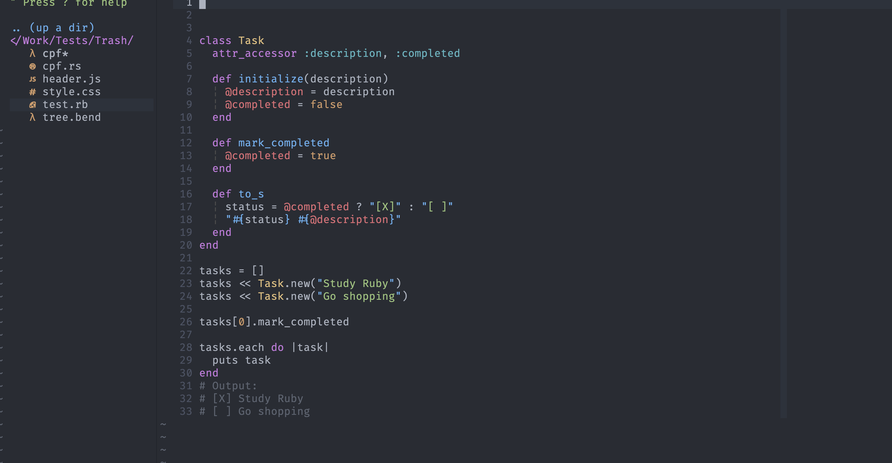
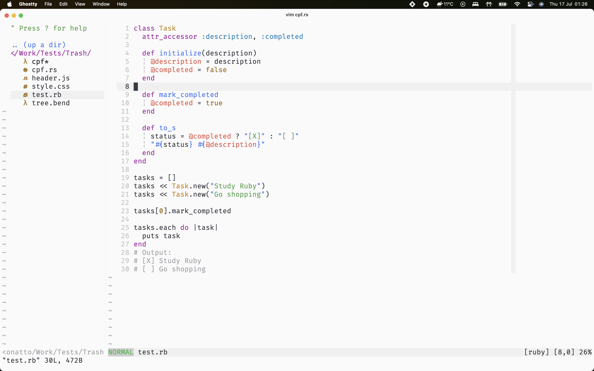

# one-vim Theme for Vim

## Overview

`one-vim` is a color scheme for Vim, inspired by the Atom One theme and adapted from the [one-nvim](https://github.com/Th3Whit3Wolf/one-nvim) project. This theme is designed specifically for Vim (not Neovim), providing a modern and visually consistent experience for both dark and light backgrounds. It includes extensive language and plugin support, as well as terminal color integration for Neovim users.

## Screenshots

Dark theme:



Light theme:



## Features

- Atom One inspired color palette
- Full support for Vim highlight groups
- Extensive language support: JavaScript, JSX, Rust, Haskell, Python, Ruby, PHP, Go, HTML, CSS, JSON, Markdown, VimL
- Dedicated highlights for Git commit messages, spelling, diffs, and select plugins (NERDTree, ALE)
- Automatic background detection (`dark`/`light`)
- Optional transparent background

## Installation

### Prerequisites

- Vim 8+


### Manual Installation

Clone the repository and copy the color scheme file:

```sh
git clone https://github.com/SergioBonatto/one-vim
cp one-vim/colors/one-vim.vim ~/.vim/colors/
```

Or copy `colors/one-vim.vim` directly to your `~/.vim/colors/` directory.

### Using Vim Plug

```vim
Plug 'SergioBonatto/one-vim'
```

### Activating the Theme

Add the following to your `.vimrc`:

```vim
colorscheme one-vim
```


## Quick Start

```sh
git clone https://github.com/SergioBonatto/one-vim
cp one-vim/colors/one-vim.vim ~/.vim/colors/
```

Add to your `.vimrc`:

```vim
colorscheme one-vim
```

## Transparent Background

If you use a terminal with a transparent background, enable transparency by adding to your `.vimrc`:

```vim
let g:one_vim_transparent_bg = 1
```

## Supported Languages and Plugins

See [`colors/one-vim-theme-doc.md`](colors/one-vim-theme-doc.md) for a detailed list of supported languages, syntax groups, and plugin highlights.


## Compatibility and Limitations

- This theme is for Vim 8+ and does not support Neovim directly. For Neovim, use [one-nvim](https://github.com/Th3Whit3Wolf/one-nvim).
- Some less common languages may rely on Vim's default highlight groups.
- Plugin support is limited to NERDTree and ALE by default; additional plugin integration may require manual configuration.
- Terminal color definitions are set for Neovim only. Vim users may need to configure terminal colors separately.

## Troubleshooting

- If transparency does not work, ensure your terminal supports transparent backgrounds and the variable is set in your `.vimrc`.
- For plugin or language highlight issues, check [`colors/one-vim-theme-doc.md`](colors/one-vim-doc.md) and open an issue if needed.


## Contributing

The theme is actively maintained and open to contributions. If you encounter issues or have suggestions for language or plugin support, please open an issue or submit a pull request at [https://github.com/SergioBonatto/one-vim](https://github.com/SergioBonatto/one-vim).

## License

This project is licensed under the MIT License. See the `LICENSE` file for details.

---


_This theme is an adaptation of [one-nvim](https://github.com/Th3Whit3Wolf/one-nvim) for Vim, inspired by Atom One._
